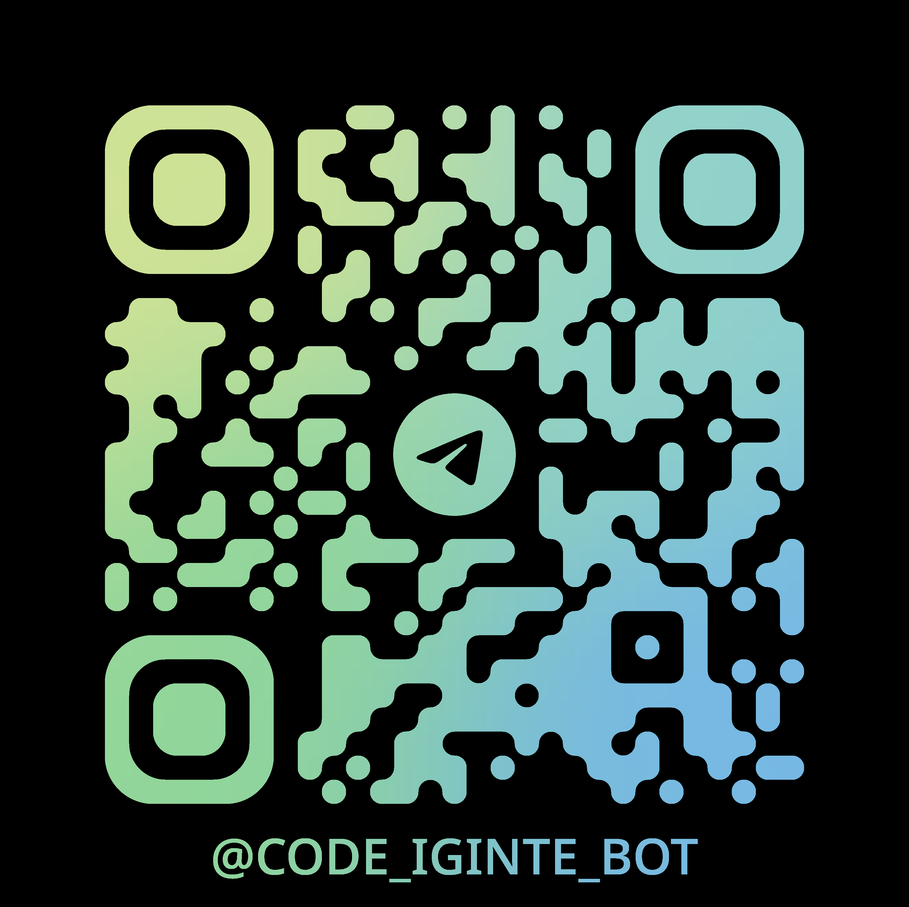

# 🚀 Code Ignite

> **AI-Powered Code Generation Platform** - Transform your ideas into beautiful, functional web applications through natural conversation, voice notes, or even Telegram.


---

## 📖 Overview

**Code Ignite** is an intelligent web application that allows you to create stunning, production-ready websites and apps by simply describing what you want to build. Powered by **Google Gemini**, **Anthropic Claude**, and **OpenRouter**, it generates complex, multi-file projects with modern design, responsive layouts, and interactive features.

---

## ✨ Key Features

### 📱 Telegram Integration (NEW!)
- **Voice to App** - Send a voice note to [@code_iginte_bot](https://t.me/code_iginte_bot) while on the go.
- **Instant Deployment** - The bot transcribes your vision and returns a live, hosted URL in seconds.
- **Pocket Development** - Build and ship full-scale web applications directly from your phone.

### 🤖 Advanced AI Generation
- **Multi-Provider Support** - Google Gemini, Anthropic Claude, OpenAI (GPT-4o), and OpenRouter.
- **Multi-File Projects (Mode 3)** - Generates complex project architectures, not just single files.
- **Multimodal Context** - Gemini can "see" your images and PDFs for design recreation.
- **Real-time Streaming** - Watch every line manifest live in the sandboxed preview.

### 🎤 Smart Voice Input 
- **Hands-Free Building** - Describe complex designs using purely spoken language in the web UI.
- **Neural Transcription** - High-speed, high-accuracy speech-to-text integration.

### 📎 Multimedia Context
- **Image-to-Code** - Upload mockups or screenshots; the AI recreates them using modern CSS.
- **PDF-to-Portfolio** - Upload your resume PDF to generate a professional portfolio site instantly.

### 🚀 One-Click Deployment
- **Netlify (Standard)** - Zero-configuration, one-click full application deployment.
- **GitHub Gist** - Create a permanent versioned link with live preview.
- **New Tab Preview** - Quick local testing and instant gratification.

### 🔄 Smart Change Management
- **Visual Diff Viewer** - Character-level comparison of AI-generated updates.
- **Apply/Reject Changes** - Semantic control over every modification the AI proposes.

---

## 📱 Connect with the Bot

Build apps from anywhere. Scan the QR code or click the link to start building via Telegram.

<div align="center">
  <br />
  <a href="https://t.me/code_iginte_bot">
    
  </a>
  <br />
  <br />
  <a href="https://t.me/code_iginte_bot">
    
  </a>
  <br />
  <h3><a href="https://t.me/code_iginte_bot">@code_iginte_bot</a></h3>
</div>

---

## 🎬 Demo

### 🎮 Minecraft Clone - Built with ONE Prompt!

[](./demos/minecraft%20clone%20.mp4)

### 💬 See Code Ignite in Action

[](./demos/ai%20coder%20prompt%20preview.mp4)

---

## 🛠️ Tech Stack

| Category | Technology |
|----------|------------|
| **Frontend** | React 19, TypeScript, Vite |
| **Styling** | TailwindCSS 4, Framer Motion |
| **Editor** | Monaco Editor |
| **AI Engine** | Google Gemini 2.0, Claude 3.5, GPT-4o, OpenRouter |
| **Utilities** | diff-match-patch, Lucide Icons |

---

## 🚀 Quick Start

### Prerequisites

- **Node.js** v18 or higher
- **API Key** (Gemini, Claude, or OpenRouter)

### Installation

```bash
# Clone the repository
git clone https://github.com/yashchandnani07/Code-Ignite.git
cd code-ignite

# Install dependencies
npm install

# Start development server
npm run dev
```

---

## 🤝 Contributing

1. Fork the repository
2. Create feature branch (`git checkout -b feature/amazing-feature`)
3. Commit changes (`git commit -m 'Add amazing feature'`)
4. Push to branch (`git push origin feature/amazing-feature`)
5. Open a Pull Request

---

## 📬 Contact

- **GitHub Issues**: [Report bugs](https://github.com/yashchandnani07/Code-Ignite/issues)
- **Developer**: Yash Chandnani (yashchandnani07@gmail.com)

---

<div align="center">

**Made with ❤️ by Yash Chandnani**

⭐ Star this repo if you find it useful!

</div>
