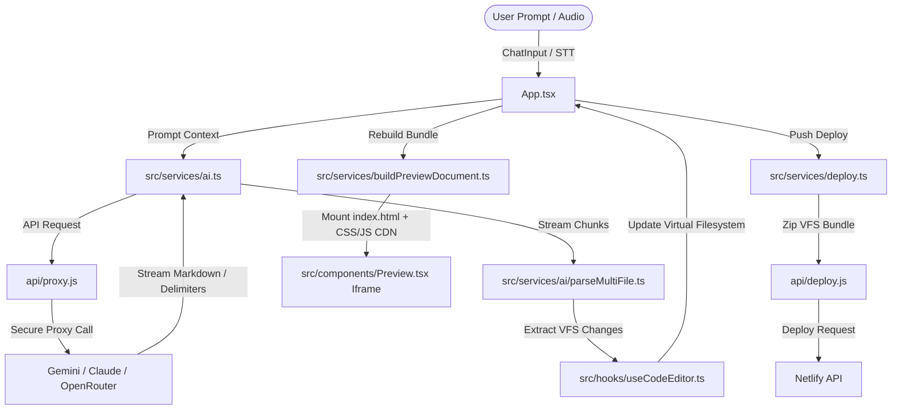

# 📂 Code Ignite - Project Structure & AI Agent Architecture

Welcome to the **Code Ignite** repository. This document serves as a comprehensive developer guide explaining the forking workflow, repository directory structure, and the inner workings of the AI code generation agent.

---

## 🛠️ Forking & Local Development Setup

To begin extending or customizing Code Ignite, follow these steps to fork and configure your local workspace.

### 1. Fork and Clone the Repository
1. Navigate to the GitHub repository: `https://github.com/yashchandnani07/Code-Ignite`
2. Click the **Fork** button in the top-right corner to create your own copy of the repository.
3. Clone your forked repository:
   ```bash
   git clone https://github.com/<your-username>/Code-Ignite.git
   cd Code-Ignite
   ```

### 2. Configure Environment Variables
Create a `.env` file in the root directory. This configures the backend proxies for deployment and speech-to-text validation:
```env
NETLIFY_AUTH_TOKEN=your_netlify_personal_access_token_here
GROQ_API_KEY=your_groq_whisper_api_key_here
```
> [!NOTE]
> Client-side AI API keys (Google Gemini, Anthropic Claude, OpenAI, OpenRouter) are managed on the frontend in the browser's `localStorage` and configured in the settings UI. They do not need to be committed in the `.env` file.

### 3. Install Dependencies & Launch Dev Server
Ensure you have **Node.js v18+** installed:
```bash
# Install dependencies
npm install

# Start Vite dev server
npm run dev
```
The application will launch on [http://127.0.0.1:4174](http://127.0.0.1:4174).

---

## 🗺️ System Architecture

The following diagram illustrates how user requests flow through Code Ignite, query the AI, construct the virtual sandbox files, and deploy live sites:



---

## 📂 Project Directory Structure

Here is a breakdown of the primary folders and files in the repository:

### 1. Root Configurations
* [package.json](file:///Users/ayushparoha/Documents/pr/Code-Ignite/package.json): Lists system dependencies and configuration overrides.
* [vite.config.js](file:///Users/ayushparoha/Documents/pr/Code-Ignite/vite.config.js): Custom Vite config setting host to `127.0.0.1` on port `4174`, excluding `monaco-editor` from optimizer pre-bundling.
* [tsconfig.json](file:///Users/ayushparoha/Documents/pr/Code-Ignite/tsconfig.json): TypeScript compilation parameters.
* [index.html](file:///Users/ayushparoha/Documents/pr/Code-Ignite/index.html): Main client entry page.

### 2. Backend / Serverless Proxy Layer (`/api`)
These endpoints double as local Express routes via the custom Vite dev server plugin and Vercel serverless functions in production:
* [api/deploy.js](file:///Users/ayushparoha/Documents/pr/Code-Ignite/api/deploy.js): Packages the flat virtual filesystem files into a JSZip archive and pushes them to the Netlify API, caching the site ID for incremental builds.
* [api/proxy.js](file:///Users/ayushparoha/Documents/pr/Code-Ignite/api/proxy.js): Bypasses CORS restrictions on the client side when executing REST streams to custom endpoints.
* [api/stt.js](file:///Users/ayushparoha/Documents/pr/Code-Ignite/api/stt.js): Receives microphone audio payloads and queries Groq's Whisper API (`whisper-large-v3`) to return prompt transcriptions.
* [api/ai-validate.js](file:///Users/ayushparoha/Documents/pr/Code-Ignite/api/ai-validate.js): Health-check validator testing user-supplied API keys for Gemini, Claude, OpenRouter, and OpenAI.

### 3. Frontend Source (`/src`)
The react codebase is split cleanly into components, custom hooks, services, and types:

#### 💻 React Entry Points
* [src/App.tsx](file:///Users/ayushparoha/Documents/pr/Code-Ignite/src/App.tsx): Parent SPA controller managing tab switching, modals, and coordinating hook state.
* [src/dev-server-plugin.ts](file:///Users/ayushparoha/Documents/pr/Code-Ignite/src/dev-server-plugin.ts): Connects Vite's server middleware directly to `/api` routes during local development.
* [src/index.css](file:///Users/ayushparoha/Documents/pr/Code-Ignite/src/index.css): Core design tokens, scroll-driven animations, and styles using Tailwind CSS.

#### 🧩 Components (`src/components`)
* [src/components/LandingPage.tsx](file:///Users/ayushparoha/Documents/pr/Code-Ignite/src/components/LandingPage.tsx): High-fidelity, animated product dashboard landing page detailing workflows and showcase projects.
* [src/components/ChatInterface.tsx](file:///Users/ayushparoha/Documents/pr/Code-Ignite/src/components/ChatInterface.tsx): Chat window supporting user input, streaming AI responses, file attachments, and recording voice notes.
* [src/components/CodeEditor.tsx](file:///Users/ayushparoha/Documents/pr/Code-Ignite/src/components/CodeEditor.tsx): Renders the Monaco editor with syntax highlighting, custom theme mappings, and diff views.
* [src/components/Preview.tsx](file:///Users/ayushparoha/Documents/pr/Code-Ignite/src/components/Preview.tsx): Serves a sandboxed sandbox inside an `iframe`, listens for unhandled errors, and provides a "Try to Fix" AI debugger.
* [src/components/DiffViewer.tsx](file:///Users/ayushparoha/Documents/pr/Code-Ignite/src/components/DiffViewer.tsx): Side-by-side patch viewer utilizing Google's `diff-match-patch` libraries.
* [src/components/FileTree.tsx](file:///Users/ayushparoha/Documents/pr/Code-Ignite/src/components/FileTree.tsx): Renders the folder structure of multi-file projects, allowing users to add, rename, or delete files.
* [src/components/FirebaseSetup.tsx](file:///Users/ayushparoha/Documents/pr/Code-Ignite/src/components/FirebaseSetup.tsx): Captures custom Firebase Realtime Database parameters.
* [src/components/SettingsModal.tsx](file:///Users/ayushparoha/Documents/pr/Code-Ignite/src/components/SettingsModal.tsx): Configures AI model parameters, API base URLs, custom credentials, and system options.

#### 🪝 Custom Hooks (`src/hooks`)
* [src/hooks/useCodeEditor.ts](file:///Users/ayushparoha/Documents/pr/Code-Ignite/src/hooks/useCodeEditor.ts): Core state driver for the virtual filesystem (`files` record), file history rollback, file edits, and project mode transitions.
* [src/hooks/useChat.ts](file:///Users/ayushparoha/Documents/pr/Code-Ignite/src/hooks/useChat.ts): Interfaces with AI stream services, tracks token lists, handles multimedia uploads, and coordinates updates.
* [src/hooks/useApiSettings.ts](file:///Users/ayushparoha/Documents/pr/Code-Ignite/src/hooks/useApiSettings.ts): Synchronizes API keys, active model selections, and Firebase profiles.
* [src/hooks/useAppNavigation.ts](file:///Users/ayushparoha/Documents/pr/Code-Ignite/src/hooks/useAppNavigation.ts): Manages overall routing state of tabs and active dialog displays.

#### ⚙️ Services Layer (`src/services`)
* [src/services/ai.ts](file:///Users/ayushparoha/Documents/pr/Code-Ignite/src/services/ai.ts): Adapter routing prompt payloads to Google AI, Anthropic, OpenRouter, or Custom endpoints, configuring SSE stream engines.
* [src/services/ai/parseMultiFile.ts](file:///Users/ayushparoha/Documents/pr/Code-Ignite/src/services/ai/parseMultiFile.ts): Scans incoming streaming text, parsing project file demarcations (`=== FILE: <path> ===` and `=== DELETE: <path> ===`) dynamically to build/update the flat filesystem.
* [src/services/ai/system-prompt.ts](file:///Users/ayushparoha/Documents/pr/Code-Ignite/src/services/ai/system-prompt.ts): Contains global system prompt guidelines formatting AI generation outputs (Code patterns, Design rules, Firebase rule injects).
* [src/services/buildPreviewDocument.ts](file:///Users/ayushparoha/Documents/pr/Code-Ignite/src/services/buildPreviewDocument.ts): Assembles the virtual sandbox code bundle (attaching CDN scripts, CSS files, and runtime error handlers) into a unified blob URL representing `index.html`.
* [src/services/deploy.ts](file:///Users/ayushparoha/Documents/pr/Code-Ignite/src/services/deploy.ts): Calls GitHub Gist APIs directly or POSTs the filesystem to `/api/deploy`.
* [src/services/fileProcessor.ts](file:///Users/ayushparoha/Documents/pr/Code-Ignite/src/services/fileProcessor.ts): Normalizes file uploads (handling PDF texts, converting images to Base64 data).

---

## 🤖 AI Agent Mechanics

Understanding the AI generation mechanics is key to extending Code Ignite's capabilities.

### 1. Virtual Filesystem (VFS)
In multi-file project mode, Code Ignite represents projects as a flat virtual filesystem key-value map:
```typescript
export type FileSystem = Record<string, string>;
```
Folders are inferred from slashes (e.g. `css/style.css` is mapped flatly).

### 2. Output Delimiters (Mode 3)
When generating multi-file applications, the AI model is instructed to wrap file definitions inside structured delimiters:
```text
=== FILE: css/style.css ===
body { background: #000; }

=== FILE: js/app.js ===
console.log('App initialized');

=== DELETE: old-script.js ===

=== END PROJECT ===
```
* **Adding/Modifying Files**: Handled by writing the `=== FILE: path ===` delimiter.
* **Deleting Files**: Triggered by outputting the `=== DELETE: path ===` delimiter.
* The parser [parseMultiFile.ts](file:///Users/ayushparoha/Documents/pr/Code-Ignite/src/services/ai/parseMultiFile.ts) reads this stream incrementally and patches the code in real-time.

### 3. Automatic Firebase Integration
When a user provides their Firebase credentials, the system prompt is appended with the `buildFirebasePromptAddon()` configuration in [system-prompt.ts](file:///Users/ayushparoha/Documents/pr/Code-Ignite/src/services/ai/system-prompt.ts#L623-L671). The prompt forces the LLM to:
1. Inject the Firebase Compat SDK scripts automatically.
2. Initialize Firebase Anonymous Auth.
3. Automatically prefix read/write pathways with `users/auth.uid/` to conform to database security guidelines.

---

## 🤝 Development Guidelines

1. **Preserve Delimiter Parser Integrity**: Any alterations to how files are outputted must synchronize with both [system-prompt.ts](file:///Users/ayushparoha/Documents/pr/Code-Ignite/src/services/ai/system-prompt.ts) and [parseMultiFile.ts](file:///Users/ayushparoha/Documents/pr/Code-Ignite/src/services/ai/parseMultiFile.ts).
2. **CDN Only in Generated Apps**: When the agent constructs applications, it cannot resolve `node_modules` dependencies. Verify that the agent always outputs standard CDN URLs (e.g., standard Tailwind, Lucide, Chart.js packages) in the generated `index.html`.
3. **Sandbox Security**: Generated app scripts run in an `iframe` sandbox. Ensure that updates to the preview container maintain proper restrictions on storage access and frame isolation.
